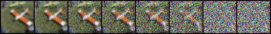
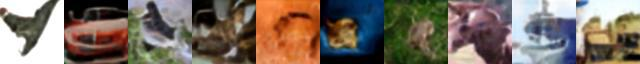

# Compact Diffusion Models

## Introduction
Compact Diffusion Models are designed to offer a more efficient alternative to traditional diffusion models. These models aim to be smaller and faster, while maintaining effectiveness, making them suitable for a variety of applications where computational resources or time are limited.

## Features
- **Efficiency**: Smaller model size and faster processing without significant loss in quality.
- **Flexibility**: Suitable for a range of applications where traditional diffusion models are typically used.

## Repository Contents
- `configs`: Configuration files for the models.
- `ddpm.py`: Training script for unconditional DDPM generation.
- `ddpm_conditional.py`: Training script for conditional DDPM generation.
- `generate.py`: Script for generating outputs using the models.
- `modules.py`: Contains various modules used in the models.
- `noising_test.py`: Script for testing the noising process.
- `pruning.py`: Implements pruning techniques for model efficiency.
- `quantize.py`: Quantization methods for model optimization.
- `run.sh`: Shell script for running the model.
- `single_generation.py`: Script for single image generation.
- `utils.py`: Utility functions used across the project.

## Getting Started
To use these models, clone this repository and install the required dependencies. Example usage can be found in the `run.sh` script.

## Requirements
- Python 3.x
- Dependencies as listed in `environment.yml` file.
- Recreate the original environment using `conda env create -f environment.yml`.
## Results

| Setup | Architecture | Method                    | EMA | MPT | Size (MB) | Inference Time | FID   |
|-------|--------------|---------------------------|-----|-----|-----------|----------------|-------|
| 1     | UNet         | Base                      | ×   | ×   | 93.4      | 27s            | 29.72 |
| 2     | UNet         | Base                      | ✓   | ×   | 93.4      | 22s            | 25.84 |
| 3     | UNet         | Base                      | ✓   | ✓   | 93.4      | 22s            | 25.92 |
| 4     | UNet         | + Pruning                 | ✓   | ✓   | 64.2      | 21s            | 43.36 |
| 5     | UNetMini     | Compression               | ✓   | ✓   | 23.7      | 18s            | 33.82 |
| 6     | UNetMini     | + KD loss                 | ✓   | ✓   | 23.7      | 18s            | 37.82 |
| 7     | UNetMini     | + KD loss + Pruning       | ✓   | ✓   | 15.3      | 19s            | 59.01 |

## Generations

| Model Setup       | Generated Images |
|-------------------|------------------|
| 1. Base           |  |
| 2. Base + EMA    |  |
| 3. Base + MPT    |  |
| 4. Base + KD + Pruning|  |
| 5. Mini + EMA + MPT|  |
| 6. Base + KD     |  |
| 7. Base + Pruning|  |

## License
This project is licensed under the Apache-2.0 License - see the [LICENSE](LICENSE) file for details.

## Acknowledgments
- Our base code is built on top of [@dome272](https://github.com/dome272/Diffusion-Models-pytorch) work. We build several new optimizations, and methods on top of this codebase.

